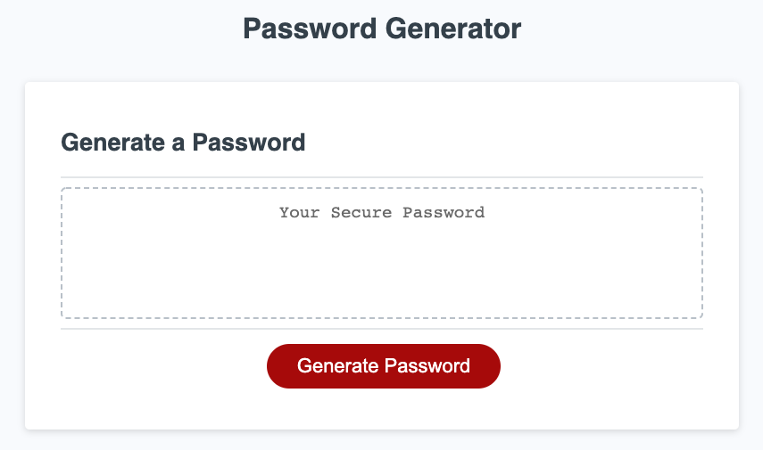
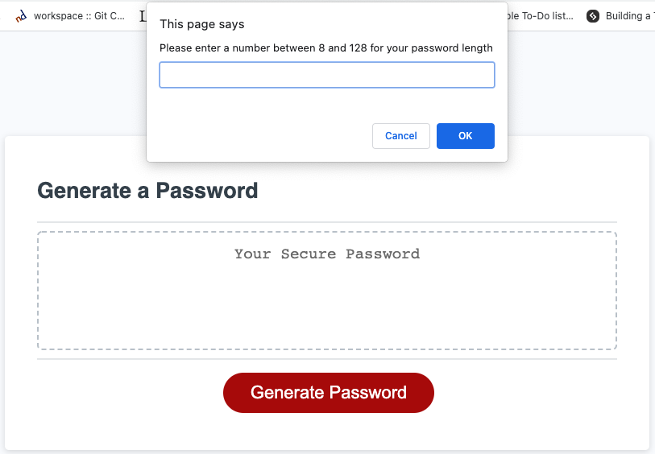
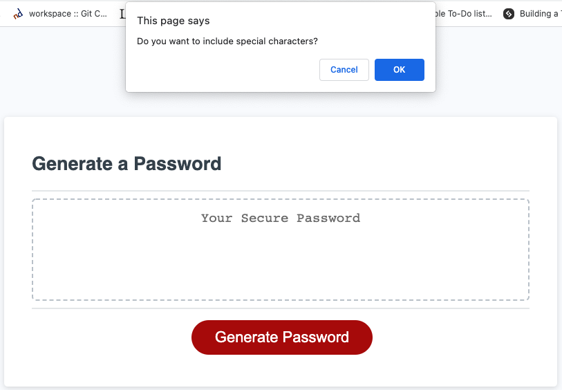
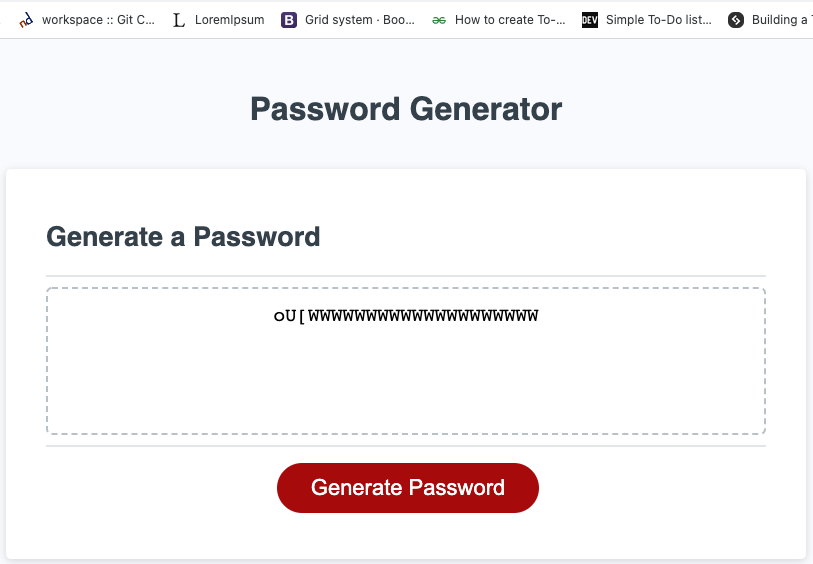

<h1 align='center'>Weekly Assignment Title: password-generator</h1>

* **This is an application that generates a random password based on user-selected criteria. The application is run in the web browser.** 
  

## **Description**
* _When users run this app in the browser, they wil be given an option to chose the length of their password and then they will be also provided with choices for type of characters they want in their password.
With simple click the new password will be generated. User can copy this password by using select+copy+paste to their desired location._

## Table of Contents
* [Installation](#installation)
* [Usage](#usage)
* [Badges](#badges)
* [Features](#features)
* [Tests](#tests)
* [Credits](#credits)
* [Contributing](#contributing)
* [License](#license)

### **Installation**
###### [Back to Table of Contents](#Table-of-Contents)
* This is an application is simple to use, just needs opening in the browser. 
1. Once opened, the application will prompt the user for input, and
2. After receiving all required inputs, 
3. The application will generate a new password. 

### **Usage**
###### [Back to Table of Contents](#Table-of-Contents)
* This application is mainly created out of curiousity and for easier generating of misc passwords. Challenge for beginners but please after it is done! When you need a new paswowrd, do not go further than this application and create your passwords quick and easy. You can easily copy-paste your new password from the screen and save it somewhere safe!

### **Badges**
###### [Back to Table of Contents](#Table-of-Contents)

    
    
    
    </a>

    
    
    

### **Features**
###### [Back to Table of Contents](#Table-of-Contents)
#### **Tests**
* Test Generated Password Screenshots
<h3 align="center" width="100%">
  1. Landing Page 

    

  2. Prompts example 

    

  2. Prompts example-1  

    

  3. Generated Password Example 

    

</h3>

### **Credits**
###### [Back to Table of Contents](#Table-of-Contents)
* UW BootCamp TAs, instructors, tutors, AskCBS and all other that helped!

### **Contributing**
###### [Back to Table of Contents](#Table-of-Contents)
* Made with ❤️ by _Fahrija Wyroski_

### **License**
###### [Back to Table of Contents](#Table-of-Contents)
 _password-generator by Fahrija Wyroski 2021 All Rights Reserved._
  _All material must be cited or credited, when using material (free to use)._
     
#### **MIT License**

** Permission is hereby granted, free of charge, to any person obtaining a copy of this software and associated documentation files (the "Software"), to deal in the Software without restriction, including without limitation the rights to use, copy, modify, merge, publish, distribute, sublicense, and/or sell copies of the Software, and to permit persons to whom the Software is furnished to do so, subject to the following conditions:

The above copyright notice and this permission notice (including the next paragraph) shall be included in all copies or substantial portions of the Software.

THE SOFTWARE IS PROVIDED "AS IS", WITHOUT WARRANTY OF ANY KIND, EXPRESS OR IMPLIED, INCLUDING BUT NOT LIMITED TO THE WARRANTIES OF MERCHANTABILITY, FITNESS FOR A PARTICULAR PURPOSE AND NONINFRINGEMENT. IN NO EVENT SHALL THE AUTHORS OR COPYRIGHT HOLDERS BE LIABLE FOR ANY CLAIM, DAMAGES OR OTHER LIABILITY, WHETHER IN AN ACTION OF CONTRACT, TORT OR OTHERWISE, ARISING FROM, OUT OF OR IN CONNECTION WITH THE SOFTWARE OR THE USE OR OTHER DEALINGS IN THE SOFTWARE.
###### [Back to Table of Contents](#Table-of-Contents)